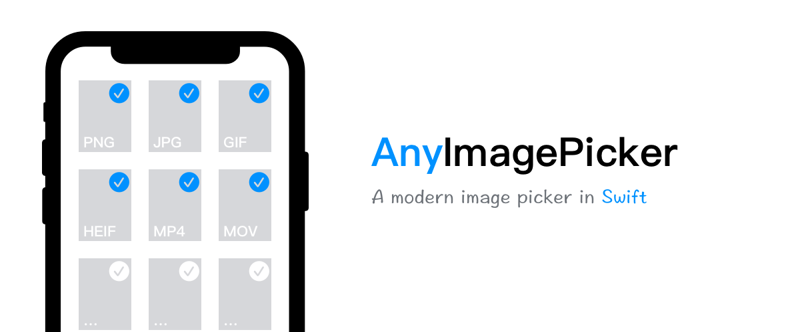

`AnyImagePicker` 是一个支持多选的图片选择器，支持选择照片、视频和 GIF。使用 Swift 编写。

## 功能

- [x] UI 外观支持浅色/深色/自动 (iOS 13.0+)
- [x] 默认主题与微信相似
- [x] 支持多选/混合内容选择
- [ ] 支持的媒体类型:
    - [x] Photo
    - [x] GIF
    - [ ] Live Photo
    - [x] Video
- [ ] 支持在选择时直接拍照
- [ ] 编辑图片
- [ ] 多平台支持
    - [x] iOS
    - [ ] iPadOS
    - [ ] Mac Catalyst
    - [ ] macOS
    - [ ] tvOS

## 要求

- iOS 10.0+
- Xcode 11.0+
- Swift 5.0+

## 安装

### [CocoaPods](https://guides.cocoapods.org/using/using-cocoapods.html)

将下面内容添加到 `Podfile`，并执行依赖更新

```ruby
pod 'AnyImagePicker'
```

### [Carthage](https://github.com/Carthage/Carthage)

将下面内容添加到 `Cartfile`，并执行依赖更新

```ogdl
github "anotheren/AnyImagePicker"
```

## 使用方法

### 快速上手

```swift
import AnyImagePicker

let controller = ImagePickerController(delegate: self)
present(controller, animated: true, completion: nil)

/// ImagePickerControllerDelegate
func imagePicker(_ picker: ImagePickerController, didSelect assets: [Asset], useOriginalImage: Bool) {
    let image = assets.image
    // Your code
}
```

### 获取内容数据
```swift
/// Fetch Video URL 
/// - Note: Only for `MediaType` Video
/// - Parameter options: Video URL Fetch Options
/// - Parameter completion: Video URL Fetch Completion
func fetchVideoURL(options: VideoURLFetchOptions = .init(), completion: @escaping VideoURLFetchCompletion)

// Call
asset.fetchVideoURL { (result) in
    // Your code
}
```


## 版权协议

AnyImagePicker 基于 MIT 协议进行分发和使用，更多信息参见[协议文件](./LICENSE)。